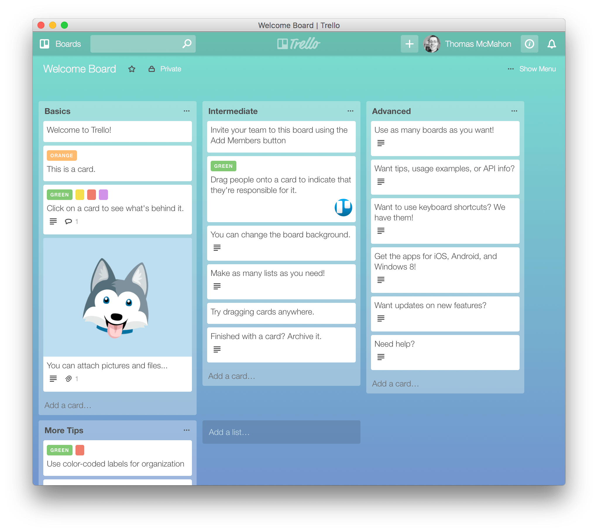

# MelloTrello
## A sleek Trello theme. Install via [Userstyles.org](https://userstyles.org/styles/119907/mellotrello)

by Thomas McMahon | [TwisterMc](http://www.twistermc.com) | v1.1

MelloTrello is a Trello theme that can be applied with Stylish. It's meant to be easy on the eyes and be a bit  Mac like. It also shows text on labels and is responsive.

**With MelloTrello**

**Without**

Stylish is available for:

- [Chrome](https://chrome.google.com/webstore/detail/stylish/fjnbnpbmkenffdnngjfgmeleoegfcffe)
- [Safari](http://sobolev.us/stylish/)
- [Firefox](https://addons.mozilla.org/en-US/firefox/addon/stylish/?src=external-userstyleshome)

I've only tested in MelloTrello in Chrome and Safari on my Mac but it should work fine with any modern browser.

MelloTrello is sure to have some bugs so please report them, or better yet, do a pull request and fix them.

MelloTrello has not been tested with a paid Trello account or any third party extensions or apps.

There's no mobile support either unless someone knows how to make that happen. I sure don't.

Feel free to use the code to create your own style too.

## Release Notes

###Version 1.1:
- Show text on labels.
- Boards now stack, aka responsive. This works great on smaller screens or in Vivaldi's siebar.

###Version 1.1:
- Initial Release
